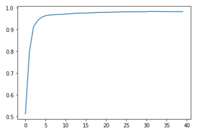

## fastAI第四章学习笔记-第四部分:Optimizer和Nonlinearity
### Creating an Optimizer

首先我们可以用PyTorch中的nn.Linear模块(module)代替[前文](fastAI学习笔记-04-mnist-basics-3.md)中的linear1. _module_ 是一个从```nn.Module```类继承的子类的对象. 此类的对象的行为与标准Python函数相同，因为你可以使用括号来调用它们，并且它们将返回模型的激活值。  
```nn.Linear```的作用和我们前面自己实现的```init_params```和```linear```两个函数一起一样.它一个类里同时包含了_weihts_ 和 _bias_ . 看看是怎样替代前文的部分：
```
linear_model = nn.Linear(28*28, 1)
```
每个PyTorch 模块都知道可以训练哪些参数。 它们可通过```parameters```方法获得：
```
w,b = linear_model.parameters()
w.shape,b.shape
```
>(torch.Size([1, 784]), torch.Size([1]))  

我们可以使用此信息来创建优化器
```
class BasicOptim:
    def __init__(self,params,lr): self.params,self.lr = list(params),lr

    def step(self, *args, **kwargs):
        for p in self.params: p.data -= p.grad.data * self.lr

    def zero_grad(self, *args, **kwargs):
        for p in self.params: p.grad = None
```
我们可以通过传入模型的参数来创建优化器
```
opt = BasicOptim(linear_model.parameters(), lr)
```
我们的训练循环现在可以简化为:
```
def train_epoch(model):
    for xb,yb in dl:
        calc_grad(xb, yb, model)
        opt.step()
        opt.zero_grad()
```
我们的验证函数完全不需要改变：
```
validate_epoch(linear_model)
```
>0.4608

让我们将小的训练循环放入一个函数中，以使事情变得更简单：
```
def train_model(model, epochs):
    for i in range(epochs):
        train_epoch(model)
        print(validate_epoch(model), end=' ')
```
结果与上一节相同：
```
train_model(linear_model, 20)
```
>0.4932 0.7686 0.8555 0.9136 0.9346 0.9482 0.957 0.9634 0.9658 0.9678 0.9697 0.9717 0.9736 0.9746 0.9761 0.977 0.9775 0.9775 0.978 0.9785  

fastai提供一个```SGD```类，默认情况下，该类与```BasicOptim```起相同的作用：
```
linear_model = nn.Linear(28*28,1)
opt = SGD(linear_model.parameters(), lr)
train_model(linear_model, 20)
```
>0.4932 0.8179 0.8496 0.9141 0.9346 0.9482 0.957 0.9619 0.9658 0.9673 0.9692 0.9712 0.9741 0.9751 0.9761 0.9775 0.9775 0.978 0.9785 0.979 

fastai还提供了```Learner.fit```，我们可以使用它代替```train_model```。 要创建一个```Learner```，我们首先需要通过传递我们的训练```DataLoader```和验证```DataLoader``` 来创建一个```DataLoaders```：
```
dls = DataLoaders(dl, valid_dl)
```
要不适用一个应用(例如cnn_learner)创建一个```Learner```, 我们就需要传入所有这一章创建的元素：```DataLoaders```， 模型，优化器函数(会传入参数给它),损失函数,以及(可选的)任意用来打印指标.
```
learn = Learner(dls, nn.Linear(28*28,1), opt_func=SGD,
                loss_func=mnist_loss, metrics=batch_accuracy)
```
现在我们调用```fit```
```
learn.fit(10, lr=lr)
```
|epoch|	train_loss|	valid_loss|	batch_accuracy|	time|
|----|----|----|----|----|
|0|	0.636709|	0.503144|	0.495584|	00:00|  
|1|	0.429828|	0.248517|	0.777233|	00:00|
|2|	0.161680|	0.155361|	0.861629|	00:00|  
|3|	0.072948|	0.097722|	0.917566|	00:00|  
|4|	0.040128|	0.073205|	0.936212|	00:00| 
|5|	0.027210|	0.059466|	0.950442|	00:00|  
|6|	0.021837|	0.050799|	0.957802|	00:00|  
|7|	0.019398|	0.044980|	0.964181|	00:00|  
|8|	0.018122|	0.040853|	0.966143|	00:00|  
|9|	0.017330|	0.037788|	0.968106|	00:00|  


如你所见，PyTorch和fastai类没有什么神奇之处。 它们只是方便的预包装件，让你更轻松！ （它们还提供了很多额外的功能，我们将在以后的章节中使用。）
通过这些类，我们现在可以将神经网络替换为线性模型。

### Adding a Nonlinearity
到目前为止，我们已经有了用于优化函数参数的通用过程，并且已经在一个非常无聊的函数上进行了尝试：一个简单的线性分类器。 线性分类器在其功能方面受到很大限制。 为了使其更加复杂（并能够处理更多任务），我们需要在两个线性分类器之间添加一些非线性的东西，这就是给我们提供神经网络的原因。

这是基本神经网络的完整定义：
```
def simple_net(xb): 
    res = xb@w1 + b1
    res = res.max(tensor(0.0))
    res = res@w2 + b2
    return res
```
仅此而已！ ```simple_net```中只有两个线性分类器，它们之间有个```max```函数。
这里，```w1```和```w2```是权重张量，```b1```和```b2```是偏置张量； 也就是说，最初是随机初始化的参数，就像我们在上一节中所做的那样：
```
w1 = init_params((28*28,30))
b1 = init_params(30)
w2 = init_params((30,1))
b2 = init_params(1)
```

关键在于```w1```具有30个输出激活（这意味着```w2```必须具有30个输入激活，因此它们匹配）。 这意味着第一层可以构造30个不同的特征，每个特征代表一些不同的像素混合。 您可以将其更改为```30```，以使模型更加复杂。

这个小的函数```res.max(tensor(0.0))```称为整流线性单位，也称为ReLU。 我们认为我们都可以同意，整流线性单位听起来很花哨而且很复杂...但是，实际上，除了```res.max(tensor(0.0))```之外，没有什么比这更多的了，也就是说，将每个负数都替换为零。 在PyTorch中也可以使用```F.relu```这个小功能：
```
plot_function(F.relu)
```
  
基本思想是，通过使用更多的线性层，我们可以使模型进行更多的计算，从而对更复杂的函数进行建模。 但是没有必要将一个线性层直接放在另一个线性层上，因为当我们将事物相乘然后再相加多次时，可以通过将不同的事物相乘并相加一次来代替！ 也就是说，可以用具有不同参数集的单个线性层替换连续的一系列任意数量的线性层。

但是，如果我们在它们之间放置一个非线性函数(例如```max```)，则不再适用。 现在，每个线性层实际上都已与其他线性层解耦，并且可以做自己有用的工作。 ```max```函数特别有趣，因为它作为简单的```if```语句运行。

>在数学上，我们说两个线性函数的组合是另一个线性函数。 因此，我们可以在彼此之上堆叠任意数量的线性分类器，并且它们之间没有非线性函数，它将与一个线性分类器相同。

足够令人惊讶的是，如果可以找到```w1```和```w2```的正确参数，并且使这些矩阵足够大，则可以用数学方式证明此小函数可以以任意较高的精度解决任何可计算的问题。 对于任何任意摆动的函数，我们可以将其近似为一束连接在一起的线。 为了使其更接近摆动功能，我们只需要使用较短的行即可。 这被称为通用逼近定理。 我们在这里拥有的三行代码称为层。 第一和第三层被称为线性层，第二行代码被不同地称为非线性或激活函数。

就像在上一节中一样，我们可以利用PyTorch将代码替换为更简单的代码：
```
simple_net = nn.Sequential(
    nn.Linear(28*28,30),
    nn.ReLU(),
    nn.Linear(30,1)
)
```
```nn.Sequential```创建一个模块，该模块将依次调用每个列出的层或函数。  
```nn.ReLU```是一个PyTorch模块，其功能与```F.relu```函数完全相同。 可以出现在模型中的大多数功能也具有与模块相同的形式。 通常，这只是用nn替换F并更改大小写的情况。 当使用```nn.Sequential```时，PyTorch要求我们使用模块版本。 由于模块是类，因此我们必须实例化它们，这就是为什么在此示例中看到```nn.ReLU()```的原因。  
因为```nn.Sequential```是一个模块，所以我们可以获得它的参数，这将返回它包含的所有模块的所有参数的列表。 让我们尝试一下！ 由于这是一个更深层次的模型，因此我们将使用较低的学习率和更多的时期。
```
learn = Learner(dls, simple_net, opt_func=SGD,
                loss_func=mnist_loss, metrics=batch_accuracy)
```
```
#hide_output
learn.fit(40, 0.1)
```
|epoch|	train_loss|	valid_loss|	batch_accuracy|	time|
|----|----|----|----|----|
0|	0.333021|	0.396112|	0.512267|	00:00
1|	0.152461|	0.235238|	0.797350|	00:00
2|	0.083573|	0.117471|	0.911678|	00:00
3|	0.054309|	0.078720|	0.940628|	00:00
4|	0.040829|	0.061228|	0.956330|	00:00
5|	0.034006|	0.051490|	0.963690|	00:00
6|	0.030123|	0.045381|	0.966634|	00:00
7|	0.027619|	0.041218|	0.968106|	00:00
8|	0.025825|	0.038200|	0.969087|	00:00
9|	0.024441|	0.035901|	0.969578|	00:00
10|	0.023321|	0.034082|	0.971541|	00:00
11|	0.022387|	0.032598|	0.972031|	00:00
12|	0.021592|	0.031353|	0.974485|	00:00
13|	0.020904|	0.030284|	0.975466|	00:00
14|	0.020300|	0.029352|	0.975466|	00:00
15|	0.019766|	0.028526|	0.975466|	00:00
16|	0.019288|	0.027788|	0.976448|	00:00
17|	0.018857|	0.027124|	0.977429|	00:00
18|	0.018465|	0.026523|	0.978410|	00:00
19|	0.018107|	0.025977|	0.978901|	00:00
20|	0.017777|	0.025479|	0.978901|	00:00
22|	0.017191|	0.024601|	0.980373|	00:00
23|	0.016927|	0.024213|	0.980373|	00:00
24|	0.016680|	0.023855|	0.981354|	00:00
25|	0.016449|	0.023521|	0.981354|	00:00
26|	0.016230|	0.023211|	0.981354|	00:00
27|	0.016023|	0.022922|	0.981354|	00:00
28|	0.015827|	0.022653|	0.981845|	00:00
29|	0.015641|	0.022401|	0.981845|	00:00
30|	0.015463|	0.022165|	0.981845|	00:00
31|	0.015294|	0.021944|	0.983317|	00:00
32|	0.015132|	0.021736|	0.982826|	00:00
33|	0.014977|	0.021541|	0.982826|	00:00
34|	0.014828|	0.021357|	0.982336|	00:00
35|	0.014686|	0.021184|	0.982336|	00:00
36|	0.014549|	0.021019|	0.982336|	00:00
37|	0.014417|	0.020864|	0.982336|	00:00
38|	0.014290|	0.020716|	0.982336|	00:00
39|	0.014168|	0.020576|	0.982336|	00:00

为了节省空间，此处未显示40行输出。 训练过程记录在learn.recorder中，输出表存储在values属性中，因此我们可以将训练的准确性绘制为：
```
plt.plot(L(learn.recorder.values).itemgot(2));
```


我们可以查看最终精度：
```
learn.recorder.values[-1][2]
```
>0.98233562707901

在这一点上，我们有一些相当神奇的东西：
1. 给定正确的参数集，可以以任何精度（神经网络）解决任何问题的函数
2. 一种为任何函数找到最佳参数集的方法（随机梯度下降）

这就是为什么深度学习可以完成看似神奇的事情，如奇妙的事情。 相信简单技术的这种组合可以真正解决任何问题，是我们发现许多学生必须采取的最大步骤之一。 这似乎太不可思议了—当然，事情应该比这更困难和复杂吗？ 我们的建议：尝试一下！ 我们只是在MNIST数据集上进行了尝试，您已经看到了结果。 而且由于我们从头开始做所有事情（计算梯度除外），所以您知道幕后没有隐藏任何特殊的魔术。

### Going Deeper
无需仅停留在两个线性层。 只要我们在每对线性层之间添加非线性，就可以根据需要添加任意数量。 但是，您将学到，模型越深入，在实践中优化参数就越困难。 在本书的后面，您将学到一些简单而有效的技巧，它们可以用来训练更深的模型。

我们已经知道，具有两个线性层的单个非线性足以逼近任何函数。 那么为什么我们要使用更深层次的模型呢？ 原因是性能。 对于更深层次的模型（即一个具有更多层的模型），我们不需要使用太多参数。 事实证明，与使用较大矩阵和较少层的矩阵相比，可以使用较小的矩阵和更多的层，并获得更好的结果。

这意味着我们可以更快地训练模型，并且它将占用更少的内存。 在1990年代，研究人员非常关注普遍逼近定理，以至于很少有人尝试一种以上的非线性。 这一理论但不切实际的基础阻碍了该领域多年。 但是，一些研究人员对深度模型进行了实验，最终证明这些模型在实践中可以表现得更好。 最终，获得了理论结果，说明了为什么会发生这种情况。 如今，找到使用非线性神经网络的人是非常不寻常的。

在这里，当我们使用与我们看到的相同方法训练18层模型时会发生什么
```
dls = ImageDataLoaders.from_folder(path)
learn = cnn_learner(dls, resnet18, pretrained=False,
                    loss_func=F.cross_entropy, metrics=accuracy)
learn.fit_one_cycle(1, 0.1)
```
epoch|	train_loss|	valid_loss|	accuracy|	time
|----|----|----|----|----|
0|	0.065800|	0.017196|	0.994112|	00:16

准确性接近100％！ 与我们的简单神经网络相比，这是一个很大的差异。 但是，正如您将在本书的其余部分中了解到的那样，您只需使用一些小技巧就可以从头开始获得如此出色的结果。 您已经知道关键的基础部分。 (当然，即使您知道所有技巧，您几乎总是要使用PyTorch和fastai提供的预构建类，因为它们使您不必自己考虑所有小细节。)
