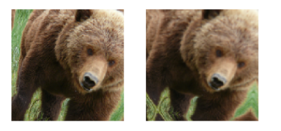
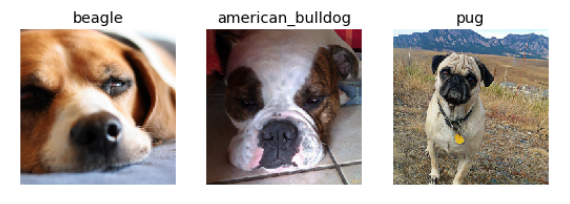

## FastAI 第5章学习笔记

### Image Classification
现在深入一点，什么是计算机视觉模型(computer vision model), NLP模型, tabular模型等等？怎样构建一个符合你特定领域需求的框架？
怎样从训练过程中得到尽可能最好的结果？怎样处理更快?当数据集发生变化时，我们应该做怎样的修改？现在在第一章例子的基础上做两件事：  
- 优化
- 使其在更多种类的数据上得到应用

为此,我们需要学会：各种layers(层),正则化方法,优化器,怎样把各层放到一个架构中,标记方法技巧等等.

### From Dogs and Cats to Pet Breeds

第一个模型演示了怎样区分狗子和猫子. 就在几年前,这是一个很大的挑战,但现在so easy！而且事实证明,同样的数据集允许我们解决一些更有
挑战性的问题：指出途中宠物的品种.  
网站上已经下载了“宠物”的数据集.
```
from fastai.vision.all import *
path = untar_data(URLs.PETS)
```
通过python的```untar```函数解压到本地,可以看看```URLs.PETS```的链接和```path```这个本地路径
```
URLs.PETS
```
> 'https://s3.amazonaws.com/fast-ai-imageclas/oxford-iiit-pet.tgz'

```
path
```
> Path('/root/.fastai/data/oxford-iiit-pet')

数据布局是深度学习难题的重要组成部分,数据一般以这两种方式提供：  
- 每个文件表示一项数据,例如文本文件,图像,可能是以目录归类或者文件名的形式表示这些项目的信息.
- 一个数据表,例如以CSV的形式,里面每行是一项数据,可能包含文件名,与其他形式如图片文档相关联.

在特定领域,也有一些例外,如在基因学中,可以是二进制的数据库甚至可以是网络流.但绝大多数领域还是上面那两种,或两种的结合.
用```ls```方法看下数据集里面有什么
```
Path.BASE_PATH = path
path.ls()
```
> (#2) [Path('annotations'),Path('images')]

可以看到有annotations 和 images 两个目录. 数据集的[官网](https://www.robots.ox.ac.uk/~vgg/data/pets/)说annotations目录包含宠物的分部地区而不是宠物是什么.我们现在要辨认的是宠物品种,而不是地区分部,所以不必关心这个目录.所以看看images里有什么：
```
(path/"images").ls()
```
>(#7393) [Path('images/japanese_chin_131.jpg'),Path('images/Bombay_4.jpg'),Path('images/Birman_43.jpg'),Path('images/Maine_Coon_57.jpg'),Path('images/pug_80.jpg'),Path('images/english_cocker_spaniel_140.jpg'),Path('images/american_bulldog_175.jpg'),Path('images/boxer_154.jpg'),Path('images/saint_bernard_104.jpg'),Path('images/wheaten_terrier_59.jpg')...]

FastAI中很多函数和方法返回集合时会使用```L```类,```L```可以看做一个加强版的python```list```类型,相比```list```，它会提供一些加强功能,例如在列表的前面会加```#```号加数字来表示列表中元素的个数,当列表太长时,会在后面用省略号.  

检查文件名我们发现文件名是以品种名加下划线加一个数字后缀构成的，但是要注意有的品种明会包含几个单词,中间也是用下划线分隔的.
提取单个对象：
```
fname = (path/"images").ls()[0]
fname
```
>Path('images/boxer_41.jpg')

我们会需要从文件名提取品种名,这个可以用正则表达式(regex),关于正则表达式的学习也是一个很大的话题,这里放一个[python3.9.2的正则表达式官方文档](https://docs.python.org/zh-cn/3.9/library/re.html)和一篇[廖雪峰的简单教材](https://www.liaoxuefeng.com/wiki/1016959663602400/1017639890281664)
```
re.findall(r'(.+)_\d+.jpg$', fname.name)
```
>['great_pyrenees']
>
这里```findall```是python的re标准库中查找一个字符串的方法.这里查找的是下划线,点,"jpg"之前所有的字符.正则表达式在fastai中可以用来标记数据-这就是```RegexLabeller```类
```
pets = DataBlock(blocks = (ImageBlock, CategoryBlock),
                          get_items=get_image_files,
                          splitter=RandomSplitter(seed=42),
                          get_y=using_attr(RegexLabeller(r'(.+)_\d+.jpg$'), 'name'),
                          item_tfms=Resize(460),
                          batch_tfms=aug_transforms(size=224, min_scale=0.75)
dls = pets.dataloaders(path/"images")
```

上面```DataBlock```各参数含义在[第二章学习笔记](fastAI学习笔记-02-production.md)中有记录,不同的是会多两行参数：
```
item_tfms=Resize(460)
batch_tfms=aug_transforms(size=224, min_scale=0.75)
```
这两行实现了一直fastai的扩充策略,叫做 _presizing_(预设尺寸).

### Presizing

我们需要将图片对齐成相同的尺寸,这样才能整理到tensor然后传到GPU. 根据性能要求,我们应该尽可能用较少的变换实现扩充,并将图像变换为统一大小.这里有个难题,如果缩小图片来扩充的大小,各种常见的扩充会引入空白区域,降低数据质量,或同时出现这两种情况.例如将图片选择45度，会用空白填充新的边界的角区域,这不会对模型产生任何影响.为了规避这些问题,presizing时会采取这两步策略：
1. 将图片重设为相对更大的尺寸,明显大于目标训练尺寸.
2. 将所有常见的增强操作（包括调整为最终目标大小）组合为一个，并在处理结束时仅在GPU上执行一次组合操作，而不是单独执行该操作并多次插值。

调整大小的第一步是创建足够大的图像,使它们具有余量,允许在内部区域进行进一步增强变换,而不是创建空白区域.这个转换会选择图像长度或宽度中较长者为边长,并随机裁剪成一个正方形.  
第二步，将GPU用于所有数据扩充，并且所有可能破坏性的操作都一起完成，最后进行一次插值  
  
图中两步：
1. 按长度或宽度裁剪：```item_tfms```实现的就是这一步,这是在将图片copy到GPU之前执行的,只是为了保证所有图片是一样的大小.训练集中,是随机裁剪的,但在验证集中,裁剪选择的总是正中心的方形.
2. 随机裁剪并扩充,```batch_tfms```实现的这一步,从"batch"可以看出,这是在GPU上将一整批一次性处理的,也就是说,速度会很快.在验证集上，仅在此处将尺寸调整为模型所需的最终尺寸。 在训练集上，首先进行随机裁剪和任何其他扩充。

下面代码，中
右图：一张图片放大,插值,旋转然后再插值(这是所有其他深度学习库使用的方法),
左图：放大和旋转作为一步操作,然后一次性插值(这是fastAI的实现)，
```
#hide_input
#id interpolations
#caption A comparison of fastai's data augmentation strategy (left) and the traditional approach (right).
dblock1 = DataBlock(blocks=(ImageBlock(), CategoryBlock()),
                   get_y=parent_label,
                   item_tfms=Resize(460))
# Place an image in the 'images/grizzly.jpg' subfolder where this notebook is located before running this
dls1 = dblock1.dataloaders([(Path.cwd()/'images'/'grizzly.jpg')]*100, bs=8)
dls1.train.get_idxs = lambda: Inf.ones
x,y = dls1.valid.one_batch()
_,axs = subplots(1, 2)

x1 = TensorImage(x.clone())
x1 = x1.affine_coord(sz=224)
x1 = x1.rotate(draw=30, p=1.)
x1 = x1.zoom(draw=1.2, p=1.)
x1 = x1.warp(draw_x=-0.2, draw_y=0.2, p=1.)

tfms = setup_aug_tfms([Rotate(draw=30, p=1, size=224), Zoom(draw=1.2, p=1., size=224),
                       Warp(draw_x=-0.2, draw_y=0.2, p=1., size=224)])
x = Pipeline(tfms)(x)
#x.affine_coord(coord_tfm=coord_tfm, sz=size, mode=mode, pad_mode=pad_mode)
TensorImage(x[0]).show(ctx=axs[0])
TensorImage(x1[0]).show(ctx=axs[1]);
```
  
您会看到右侧的图像清晰度较差，并且在左下角具有反射填充伪影； 同样，左上方的草完全消失了。 我们发现，在实践中，使用预先确定大小可以显着提高模型的准确性，并且通常还会加快速度。

### Checking and Debugging a DataBlock

在训练前，应该检查下数据.检查数据可以用```show_batch```方法.
```
dls.show_batch(nrows=1, ncols=3)
```
  
数据科学家很可能并不熟悉数据本身,例如不知道上图中每个狗子的品种,这就需要google查对应的品种了.  
如果再构建```DataBlock```时出错(注意不一定失败),可能看不出来错误,要调试可以用```summary```方法.它尝试从提供的源创建批处理,会包含许多信息.另外如果失败,会看到错误的时间,并提供帮助信息. 例如一个常见的错误,忘记使用```Resize```变换,最终会得到不同大小的图片,并且无法处理他们,这种情况：
```
#hide_output
pets1 = DataBlock(blocks = (ImageBlock, CategoryBlock),
                 get_items=get_image_files, 
                 splitter=RandomSplitter(seed=42),
                 get_y=using_attr(RegexLabeller(r'(.+)_\d+.jpg$'), 'name'))
pets1.summary(path/"images")
```

```
Setting-up type transforms pipelines
Collecting items from /home/jhoward/.fastai/data/oxford-iiit-pet/images
Found 7390 items
2 datasets of sizes 5912,1478
Setting up Pipeline: PILBase.create
Setting up Pipeline: partial -> Categorize

Building one sample
  Pipeline: PILBase.create
    starting from
      /home/jhoward/.fastai/data/oxford-iiit-pet/images/american_pit_bull_terrier_31.jpg
    applying PILBase.create gives
      PILImage mode=RGB size=500x414
  Pipeline: partial -> Categorize
    starting from
      /home/jhoward/.fastai/data/oxford-iiit-pet/images/american_pit_bull_terrier_31.jpg
    applying partial gives
      american_pit_bull_terrier
    applying Categorize gives
      TensorCategory(13)

Final sample: (PILImage mode=RGB size=500x414, TensorCategory(13))


Setting up after_item: Pipeline: ToTensor
Setting up before_batch: Pipeline: 
Setting up after_batch: Pipeline: IntToFloatTensor

Building one batch
Applying item_tfms to the first sample:
  Pipeline: ToTensor
    starting from
      (PILImage mode=RGB size=500x414, TensorCategory(13))
    applying ToTensor gives
      (TensorImage of size 3x414x500, TensorCategory(13))

Adding the next 3 samples

No before_batch transform to apply

Collating items in a batch
Error! It's not possible to collate your items in a batch
Could not collate the 0-th members of your tuples because got the following shapes
torch.Size([3, 414, 500]),torch.Size([3, 375, 500]),torch.Size([3, 500, 281]),torch.Size([3, 203, 300])
---------------------------------------------------------------------------
RuntimeError                              Traceback (most recent call last)
<ipython-input-11-8c0a3d421ca2> in <module>
      4                  splitter=RandomSplitter(seed=42),
      5                  get_y=using_attr(RegexLabeller(r'(.+)_\d+.jpg$'), 'name'))
----> 6 pets1.summary(path/"images")

~/git/fastai/fastai/data/block.py in summary(self, source, bs, show_batch, **kwargs)
    182         why = _find_fail_collate(s)
    183         print("Make sure all parts of your samples are tensors of the same size" if why is None else why)
--> 184         raise e
    185 
    186     if len([f for f in dls.train.after_batch.fs if f.name != 'noop'])!=0:

~/git/fastai/fastai/data/block.py in summary(self, source, bs, show_batch, **kwargs)
    176     print("\nCollating items in a batch")
    177     try:
--> 178         b = dls.train.create_batch(s)
    179         b = retain_types(b, s[0] if is_listy(s) else s)
    180     except Exception as e:

~/git/fastai/fastai/data/load.py in create_batch(self, b)
    125     def retain(self, res, b):  return retain_types(res, b[0] if is_listy(b) else b)
    126     def create_item(self, s):  return next(self.it) if s is None else self.dataset[s]
--> 127     def create_batch(self, b): return (fa_collate,fa_convert)[self.prebatched](b)
    128     def do_batch(self, b): return self.retain(self.create_batch(self.before_batch(b)), b)
    129     def to(self, device): self.device = device

~/git/fastai/fastai/data/load.py in fa_collate(t)
     44     b = t[0]
     45     return (default_collate(t) if isinstance(b, _collate_types)
---> 46             else type(t[0])([fa_collate(s) for s in zip(*t)]) if isinstance(b, Sequence)
     47             else default_collate(t))
     48 

~/git/fastai/fastai/data/load.py in <listcomp>(.0)
     44     b = t[0]
     45     return (default_collate(t) if isinstance(b, _collate_types)
---> 46             else type(t[0])([fa_collate(s) for s in zip(*t)]) if isinstance(b, Sequence)
     47             else default_collate(t))
     48 

~/git/fastai/fastai/data/load.py in fa_collate(t)
     43 def fa_collate(t):
     44     b = t[0]
---> 45     return (default_collate(t) if isinstance(b, _collate_types)
     46             else type(t[0])([fa_collate(s) for s in zip(*t)]) if isinstance(b, Sequence)
     47             else default_collate(t))

~/anaconda3/lib/python3.7/site-packages/torch/utils/data/_utils/collate.py in default_collate(batch)
     53             storage = elem.storage()._new_shared(numel)
     54             out = elem.new(storage)
---> 55         return torch.stack(batch, 0, out=out)
     56     elif elem_type.__module__ == 'numpy' and elem_type.__name__ != 'str_' \
     57             and elem_type.__name__ != 'string_':

RuntimeError: invalid argument 0: Sizes of tensors must match except in dimension 0. Got 414 and 375 in dimension 2 at /opt/conda/conda-bld/pytorch_1579022060824/work/aten/src/TH/generic/THTensor.cpp:612
```

```
Setting-up type transforms pipelines
Collecting items from /home/sgugger/.fastai/data/oxford-iiit-pet/images
Found 7390 items
2 datasets of sizes 5912,1478
Setting up Pipeline: PILBase.create
Setting up Pipeline: partial -> Categorize
 
Building one sample
  Pipeline: PILBase.create
    starting from
      /home/sgugger/.fastai/data/oxford-iiit-pet/images/american_bulldog_83.jpg
    applying PILBase.create gives
      PILImage mode=RGB size=375x500
  Pipeline: partial -> Categorize
    starting from
      /home/sgugger/.fastai/data/oxford-iiit-pet/images/american_bulldog_83.jpg
    applying partial gives
      american_bulldog
    applying Categorize gives
      TensorCategory(12)
 
Final sample: (PILImage mode=RGB size=375x500, TensorCategory(12))
 
Setting up after_item: Pipeline: ToTensor
Setting up before_batch: Pipeline: 
Setting up after_batch: Pipeline: IntToFloatTensor
 
Building one batch
Applying item_tfms to the first sample:
  Pipeline: ToTensor
    starting from
      (PILImage mode=RGB size=375x500, TensorCategory(12))
    applying ToTensor gives
      (TensorImage of size 3x500x375, TensorCategory(12))
 
Adding the next 3 samples
 
No before_batch transform to apply
 
Collating items in a batch
Error! It's not possible to collate your items in a batch
Could not collate the 0-th members of your tuples because got the following 
shapes:
torch.Size([3, 500, 375]),torch.Size([3, 375, 500]),torch.Size([3, 333, 500]),
torch.Size([3, 375, 500])
```
